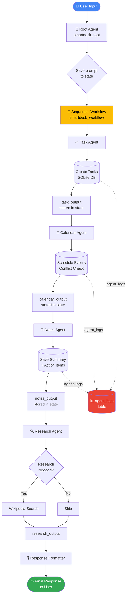
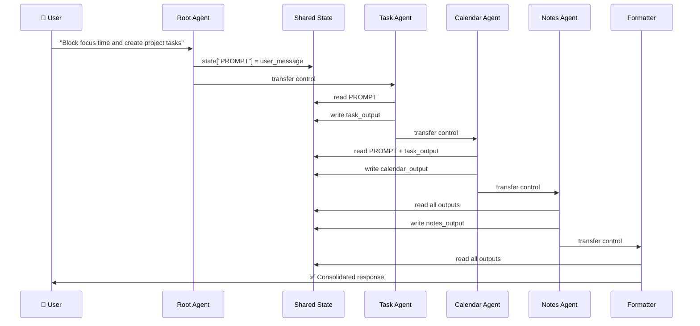

<div align="center">


<br/><br/>

# 🧠 SmartDesk — AI Chief of Staff

### *Your personal multi-agent AI productivity command center*

> Built for **Google Cloud Gen AI Academy APAC 2026 Hackathon**  
> Powered by **Google ADK + Gemini 2.5 Flash + Vertex AI + Cloud Run**

<br/>

<!-- Replace this with your actual project banner/screenshot -->


</div>

---

## 📌 Table of Contents

- [Problem Statement](#-problem-statement)
- [Solution Overview](#-solution-overview)
- [Live Demo](#-live-demo)
- [Architecture](#-architecture)
- [Agent Workflow](#-agent-workflow)
- [Flow Diagram](#-flow-diagram)
- [Tech Stack](#-tech-stack)
- [Features](#-features)
- [Getting Started](#-getting-started)
- [API Reference](#-api-reference)
- [Screenshots](#-screenshots)
- [Team](#-team)

---

## 🚨 Problem Statement

Modern professionals are overwhelmed:

- 📋 **Tasks** scattered across tools — Notion, sticky notes, emails
- 📅 **Calendar chaos** — no intelligent scheduling, constant conflicts
- 🧠 **Context switching** — jumping between 5+ apps to plan one project
- ⏳ **Time wasted** on admin instead of deep work

> *The average knowledge worker spends **2.5 hours/day** just organizing work instead of doing it.*

**SmartDesk solves this with a single conversational AI Chief of Staff that handles everything end-to-end.**

---

## 💡 Solution Overview

SmartDesk is a **multi-agent AI productivity system** built on Google ADK. You talk to it in plain English — it coordinates a team of specialized AI agents to manage your tasks, schedule your calendar, save your notes, and research anything you need.

**One prompt. Four agents. Zero chaos.**

```
"I have a product launch deadline Friday. Block 2 hours daily,
create milestones for design, dev, and testing, and save a project summary."
```

SmartDesk handles the entire workflow **automatically** — no manual input across multiple apps.

---

## 🎥 Live Demo

🔗 **Deployed URL:** `https://smartdesk-agent-xxxx-uc.a.run.app`

<!-- Replace with actual demo GIF -->


**Try this prompt on the live demo:**
```
Plan my week. I have a product launch Friday, a client meeting Wednesday at 2pm,
and need daily focus blocks for coding. Create all tasks and save a weekly summary.
```

---

## 🏗️ Architecture

SmartDesk follows a **hierarchical multi-agent architecture** powered by Google ADK's `SequentialAgent` pattern:

```
┌─────────────────────────────────────────────────────────┐
│                    USER (Chat / API)                     │
└────────────────────────┬────────────────────────────────┘
                         │
┌────────────────────────▼────────────────────────────────┐
│              ROOT AGENT (smartdesk_root)                 │
│         Greets user, saves prompt to shared state        │
└────────────────────────┬────────────────────────────────┘
                         │
┌────────────────────────▼────────────────────────────────┐
│           SEQUENTIAL WORKFLOW (smartdesk_workflow)       │
│                                                          │
│  ┌──────────┐  ┌──────────┐  ┌──────────┐  ┌────────┐  │
│  │  Task    │→ │Calendar  │→ │  Notes   │→ │Research│  │
│  │  Agent   │  │  Agent   │  │  Agent   │  │ Agent  │  │
│  └──────────┘  └──────────┘  └──────────┘  └────────┘  │
│                                                          │
│                    ↓                                     │
│           ┌─────────────────┐                           │
│           │Response Formatter│                           │
│           └─────────────────┘                           │
└──────────────────────────────────────────────────────────┘
                         │
┌────────────────────────▼────────────────────────────────┐
│              SQLite Database (Persistent)                │
│    tasks | events | notes | agent_logs                   │
└─────────────────────────────────────────────────────────┘
```

### Agent Responsibilities

| Agent | Role | Tools | Output |
|-------|------|-------|--------|
| 🧠 **Root Agent** | Entry point, saves user intent to state | `save_user_prompt` | Shared state: `PROMPT` |
| ✅ **Task Agent** | Breaks goals into tasks, sets priorities & deadlines | `create_task`, `get_all_tasks` | `task_output` |
| 📅 **Calendar Agent** | Schedules events, blocks focus time, detects conflicts | `schedule_event`, `block_daily_focus` | `calendar_output` |
| 📝 **Notes Agent** | Captures summaries, action items, tags content | `save_note`, `get_notes` | `notes_output` |
| 🔍 **Research Agent** | Answers knowledge questions via Wikipedia | `wikipedia_tool` | `research_output` |
| 🎙️ **Response Formatter** | Synthesizes all outputs into one clean response | — | Final response |

---

## 🔁 Agent Workflow

### Step-by-Step Execution Flow

When a user sends a message, here's exactly what happens:

**Step 1 — Root Agent activates**
```
User: "I have a project deadline Friday. Block 2 hours daily and create milestone tasks."
Root Agent → saves prompt to shared state → transfers to workflow
```

**Step 2 — Task Agent runs**
```
Task Agent reads PROMPT from state
→ Calls create_task("Design milestone", priority="high", deadline="Friday")
→ Calls create_task("Development milestone", priority="high", deadline="Friday")
→ Calls create_task("Testing milestone", priority="medium", deadline="Friday")
→ Stores results in task_output
→ Logs action to agent_logs table
```

**Step 3 — Calendar Agent runs**
```
Calendar Agent reads PROMPT + task_output from state
→ Calls block_daily_focus("Project Focus", start_hour=9, duration=2, days=5)
→ Checks for conflicts in events table
→ Creates 5 calendar blocks (Mon-Fri, 9am-11am)
→ Stores results in calendar_output
→ Logs action to agent_logs table
```

**Step 4 — Notes Agent runs**
```
Notes Agent reads PROMPT + task_output + calendar_output
→ Calls save_note("Project launch planned: 3 milestones created, focus time blocked daily")
→ Tags note with "project, deadline, sprint"
→ Stores result in notes_output
→ Logs action to agent_logs table
```

**Step 5 — Research Agent runs**
```
Research Agent reads PROMPT
→ Determines no external knowledge needed for this request
→ Returns "No research required"
```

**Step 6 — Response Formatter synthesizes**
```
Reads all outputs from shared state
→ Generates structured, friendly confirmation
→ Returns final response to user
```

**Final Response:**
```
✅ Tasks Created:
   • Design milestone (High Priority, due Friday)
   • Development milestone (High Priority, due Friday)
   • Testing milestone (Medium Priority, due Friday)

📅 Calendar Scheduled:
   • Focus Block: Mon-Fri, 9:00 AM - 11:00 AM (5 slots created)

📝 Notes Saved:
   • Project summary saved with tags: project, deadline, sprint

Anything else you'd like me to handle?
```

---

## 📊 Flow Diagram



### State Sharing Between Agents



---

## 🛠️ Tech Stack

| Layer | Technology | Purpose |
|-------|-----------|---------|
| **Agent Framework** | Google ADK 1.14.0 | Multi-agent orchestration |
| **LLM** | Gemini 2.5 Flash | Reasoning & language |
| **AI Platform** | Google Vertex AI | Model hosting & inference |
| **Database** | SQLite (`/tmp/`) | Persistent task/event/note storage |
| **External Knowledge** | LangChain + Wikipedia | Research capabilities |
| **Deployment** | Google Cloud Run | Serverless container hosting |
| **Logging** | Google Cloud Logging | Agent activity monitoring |
| **Auth** | Google IAM + Service Account | Secure cloud access |
| **Language** | Python 3.12 | Core implementation |

---

## ✨ Features

### Core Features
- 🤖 **Multi-Agent Orchestration** — 4 specialized agents working in sequence via Google ADK `SequentialAgent`
- 🧠 **Shared State Memory** — Agents pass context to each other through `tool_context.state`
- 💾 **Persistent Storage** — All tasks, events, and notes stored in SQLite database
- ⚡ **Conflict Detection** — Calendar agent automatically detects scheduling conflicts
- 📊 **Agent Activity Logs** — Every agent action logged with timestamp for full observability

### Productivity Features
- ✅ Create tasks with priorities (high/medium/low) and deadlines
- 📅 Block daily focus time across multiple days
- 🔄 Break complex goals into multiple milestone tasks
- 📝 Auto-generate project summaries and action items
- 🔍 Research any topic using Wikipedia integration
- 🎙️ Natural language input — no commands to memorize

### Technical Features
- 🌐 REST API via Google ADK's built-in server
- 🔒 Secure service account with minimal IAM permissions
- 📈 Cloud Logging integration for production observability
- 🚀 One-command deployment via `adk deploy cloud_run`

---

## 🚀 Getting Started

### Prerequisites

- Python 3.12+
- Google Cloud account with billing enabled
- `gcloud` CLI installed

### Local Setup

```bash
# 1. Clone the repository
git clone https://github.com/YOUR_USERNAME/smartdesk-ai.git
cd smartdesk-ai

# 2. Create virtual environment
uv venv
source .venv/bin/activate

# 3. Install dependencies
uv pip install -r requirements.txt

# 4. Configure environment
cp .env.example .env
# Edit .env with your project details

# 5. Authenticate with Google Cloud
gcloud auth application-default login

# 6. Run locally
cd ~
adk web
```

### Environment Variables

```env
PROJECT_ID=your-project-id
PROJECT_NUMBER=your-project-number
SA_NAME=smartdesk-agent
SERVICE_ACCOUNT=smartdesk-agent@your-project-id.iam.gserviceaccount.com
MODEL=gemini-2.5-flash
GOOGLE_GENAI_USE_VERTEXAI=TRUE
GOOGLE_CLOUD_LOCATION=us-central1
```

### Deploy to Cloud Run

```bash
uvx --from google-adk==1.14.0 \
adk deploy cloud_run \
  --project=$PROJECT_ID \
  --region=us-central1 \
  --service_name=smartdesk-agent \
  --with_ui \
  . \
  -- \
  --service-account=$SERVICE_ACCOUNT
```

---

## 📡 API Reference

### Send a Message

```bash
POST /run
Content-Type: application/json

{
  "message": "Create tasks for my project deadline this Friday"
}
```

### Example Prompts

```bash
# Multi-agent workflow (all agents fire)
"I have a product launch Friday. Block 2 hours daily, create design/dev/testing tasks, save a summary note."

# Task management
"Create high priority tasks for building the login page, API integration, and testing by next Monday."

# Calendar scheduling
"Block 3 hours of focus time every morning at 9am for the next 5 days."

# Research
"What is the Pomodoro technique and how can I apply it to software development?"

# Combined
"Plan my week: I have a demo Thursday, need daily coding blocks, and want to research best practices for API design."
```

---

## 📸 Screenshots

<div align="center">

| ADK Web UI | Agent Trace | Database Logs |
|-----------|-------------|---------------|
|  |  |  |

</div>

> 📌 **Add your screenshots** to the `assets/` folder and update the paths above.

---

## 📁 Project Structure

```
smartdesk/
├── agent.py              # All agents, tools, and workflow definition
├── __init__.py           # Package entry point
├── requirements.txt      # Python dependencies
├── .env                  # Environment variables (not committed)
├── .gitignore            # Git ignore rules
├── assets/               # Screenshots, banner, demo GIF
│   ├── banner.png
│   ├── demo.gif
│   ├── screenshot-ui.png
│   ├── screenshot-trace.png
│   └── screenshot-db.png
└── README.md             # This file
```

---

## 🧪 Database Schema

```sql
-- Tasks created by Task Agent
tasks (id, title, priority, deadline, status, created_at)

-- Calendar events by Calendar Agent
events (id, title, start_time, end_time)

-- Notes saved by Notes Agent
notes (id, content, tags, created_at)

-- Every agent action logged here
agent_logs (id, agent_name, action, timestamp)
```

---

## 🏆 Hackathon Alignment

| Requirement | Implementation |
|-------------|---------------|
| ✅ Primary agent coordinating sub-agents | `smartdesk_root` → `smartdesk_workflow` (SequentialAgent) |
| ✅ Store and retrieve structured data from a database | SQLite with tasks, events, notes, agent_logs tables |
| ✅ Integrate multiple tools via MCP | Wikipedia via LangchainTool; Calendar & Task tools |
| ✅ Handle multi-step workflows and task execution | SequentialAgent runs 4 agents in sequence with shared state |
| ✅ Deploy as an API-based system | Deployed on Google Cloud Run via ADK CLI |

---

## 👤 Team

**Built by:** Arpit Pandey  
**Program:** Google Cloud Gen AI Academy APAC 2026 — Hackathon Phase  
**Track:** Multi-Agent Productivity Systems

---

## 📄 License

MIT License — feel free to fork, remix, and build on top of this!

---

<div align="center">

**⭐ Star this repo if SmartDesk impressed you!**

Built with ❤️ using Google ADK, Gemini 2.5 Flash, and Cloud Run

</div>